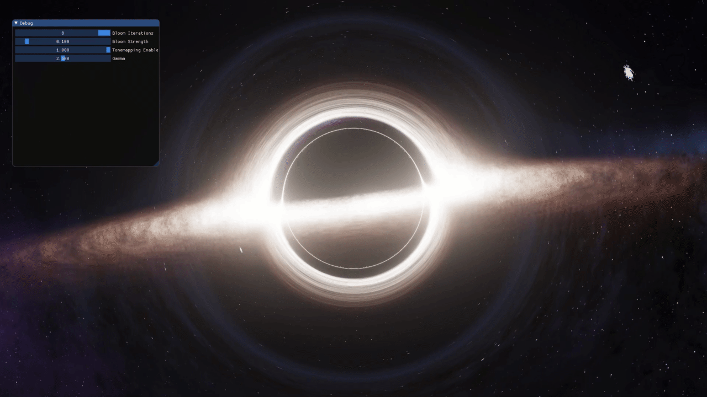

# Real-time Black Hole Rendering in OpenGL


## Build the code
```
sudo apt install -y libgl1-mesa-dev libglew-dev libxkbcommon-dev libx11-dev libwayland-dev libxrandr-dev libxinerama-dev libxcursor-dev libxi-dev build-essential cmake
cd Blackhole
git submodule update --init --recursive
mkdir build && cd build
cmake .. && make -j$(( $(nproc) - 1 ))
```

## Acknowledgements
**Papers**
- [Gravitational Lensing by Spinning Black Holes in Astrophysics, and in the Movie Interstellar](https://arxiv.org/pdf/1502.03808.pdf)
- [Trajectory Around A Spherically Symmetric Non-Rotating Black Hole - Sumanta](https://arxiv.org/pdf/1109.0676)
- [Approximating Light Rays In The Schwarzschild Field - O. Semerak](https://arxiv.org/pdf/1412.5650)
- [Implementing a Rasterization Framework for a Black Hole Spacetime - Yoshiyuki Yamashita](https://www.semanticscholar.org/paper/Implementing-a-Rasterization-Framework-for-a-Black-Yamashita/90a9b04b7153462da9d8edecdfa8262bdd689a4c?p2df)

**Articles**
- [Physics of oseiskar.github.io/black-hole](https://oseiskar.github.io/black-hole/docs/physics.html)
- [Schwarzschild geodesics](https://en.wikipedia.org/wiki/Schwarzschild_geodesics)
- [Photons and black holes](https://flannelhead.github.io/posts/2016-03-06-photons-and-black-holes.html)
- [A real-time simulation of the visual appearance of a Schwarzschild Black Hole](http://spiro.fisica.unipd.it/~antonell/schwarzschild/)
- [Ray Tracing a Black Hole in C# by Mikolaj Barwicki](https://www.codeproject.com/Articles/994466/Ray-Tracing-a-Black-Hole-in-Csharp)
- [Ray Marching and Signed Distance Functions](http://jamie-wong.com/2016/07/15/ray-marching-signed-distance-functions/)
- [Einstein's Rings and the Fabric of Space](https://www.youtube.com/watch?v=Rl8H4XEs0hw)
- [Opus 2, GLSL ray tracing tutorial](http://fhtr.blogspot.com/2013/12/opus-2-glsl-ray-tracing-tutorial.html)
- [Ray Tracing in One Weekend](https://raytracing.github.io/)
- [On ray casting, ray tracing, ray marching and the like](https://hugi.scene.org/online/hugi37/hugi%2037%20-%20coding%20adok%20on%20ray%20casting,%20ray%20tracing,%20ray%20marching%20and%20the%20like.htm)

**Other GitHub Projects**
- https://github.com/sirxemic/Interstellar
- https://github.com/ssloy/tinyraytracer
- https://github.com/RayTracing/raytracing.github.io
- https://awesomeopensource.com/projects/raytracing
- https://github.com/oseiskar/black-hole
- https://rantonels.github.io/starless/
- https://github.com/rantonels/schwarzschild
