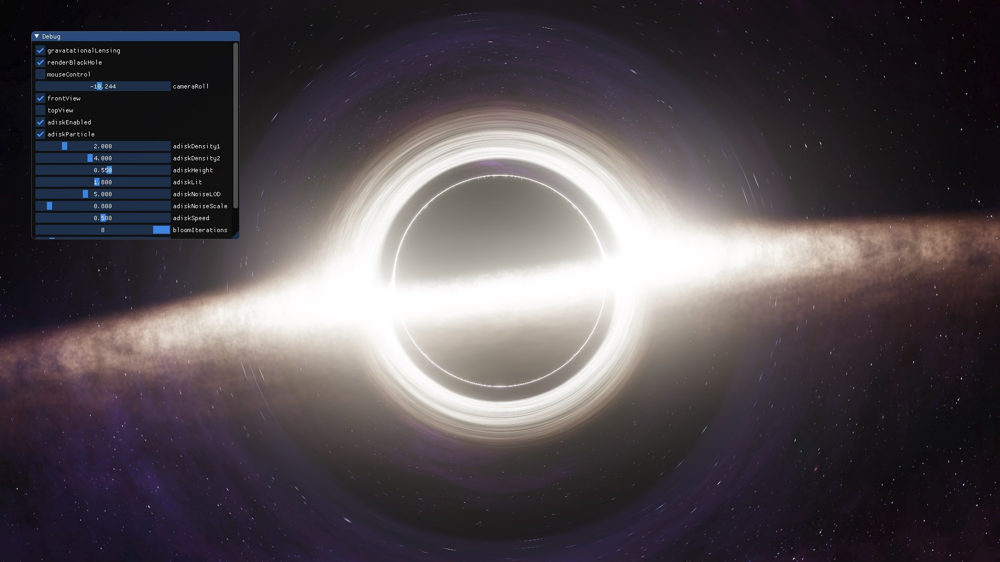

# Real-time Black Hole Rendering in OpenGL

_(WIP: refactoring, cleaning up and documenting the code)_



## Prerequisite

- cmake
- I used [vcpkg](https://github.com/microsoft/vcpkg) to install the following necessary C++ libraries for this project:
  - glew
  - glfw3
  - glm
  - imgui
  - stb

## Build the code

```
cmake \
    -DCMAKE_TOOLCHAIN_FILE=<vcpkg_dir>/scripts/buildsystems/vcpkg.cmake \
    -B build -S .
```

## Acknowledgements
